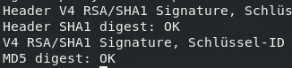
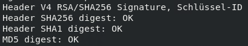

# rpm-builder-test
repository to reproduce the problem with rpm signing and Maven RPM builder plugin

*Test GPG Key* (50F70A74FA569ADE) \
*Password:* rpmbuildertest

> **pub   rsa2048 2022-07-25 [SC] [verfällt: 2024-07-24]
13EC1DEBAF84F849AA0C980550F70A74FA569ADE
uid                      rpm builder <rpmbuilder@test.com>
sub   rsa2048 2022-07-25 [E] [verfällt: 2024-07-24]**

**Import keys** \
gpg --import private.key \
gpg --import public.key \
rpm --import public.key 

**Verify import** \
gpg --list-secret-keys --keyid-format LONG

**Removal of the secret keyring**
(https://www.gnupg.org/faq/whats-new-in-2.1.html) \
*Create secring.gpg for the RPM Builder plugin (in ~/.gnupg)* \
gpg --pinentry-mode=loopback --export-secret-keys > secring.gpg \
gpg --show-keys secring.gpg

***Verify signature of created RPM (RPM Builder plugin)*** \
rpm -qvi rpm-builder-test-1.0-SNAPSHOT.noarch.rpm

> ⚠️Try to install created RPM by RPM builder plugin with YUM will fail on RHEL8 with GPG check activated \
*YUM is using /bin/rpmkeys to verify the signature (/bin/rpmkeys -Kv <rpm-file>)*

*Valid RPM signature (created by Maven RPM plugin)*

*Invalid RPM signature (created by RPM builder plugin)*

**To reproduce the problem, for example, create a local repository, add the rpm to this repository and configure the repo file accordingly with gpcheck=1**

*For example a local directory can be turned into a repository like this (yum -y install createrepo_c):*

mkdir /myrepo \
cp package.rpm /myrepo \
cd /myrepo \
createrepo . \

*now add this directory to yum:*

configuration file in /etc/yum.repos.d with baseurl set to this path and gpgcheck=1
